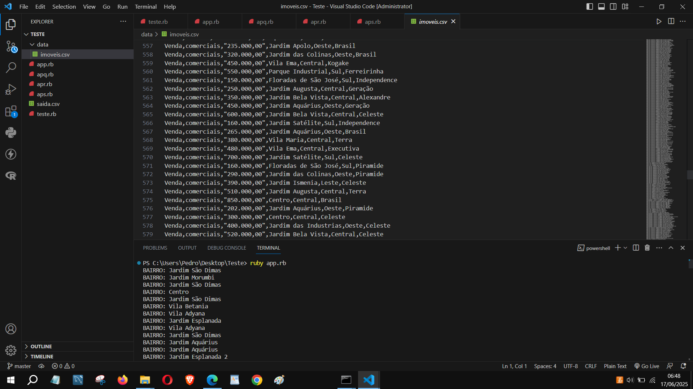

# Breve Apresentação do Repositório

Este projeto e a versão em Ruby para raspagem de dados e uso de dataset de imóveis, com uma estrutura parecida com o do Python para realizar as funcionalidades de pesquisas, assim o mesmo serve para poder trabalhar e gerar arquivos em CSV dentro do script da própria linguagem com alguns exemplos, idênticos com o projeto em Python.
A versão em Python poderá ser visualizada aqui: <https://colab.research.google.com/drive/1QsuyA7XDx1TK_eyzX3MLssaJnc7yinER?usp=sharing> possuindo mais detalhes sobre o mesmo, inclusive com caracteristicas parecidas e com mais detalhes em relação a linguagem Ruby, ambos serão aprofundados daqui a algum tempo.
Aqui um exemplo de como o script em ruby roda normalmente:

Para mais detalhes, clique no link em azul acima onde poderá ser observado com detalhes do projeto que realizei.

Para rodar o arquivo deve digitar no terminal do VSC ruby app.rb, ou qualquer um dos arquivos para simular os casos de teste, o teste.rb serve para testar o sistema se ele está rodando corretamente.

# Novidades
Agora foi inserido dentro do repositório o arquivo .inpyb que corrresponde a linguagem Python junto com o Jupyter Notebook utilizando o Drive.

# Esclarecimentos
Peço desculpas pela não exibição da imagem, o mesmo será corrigido em breve.
